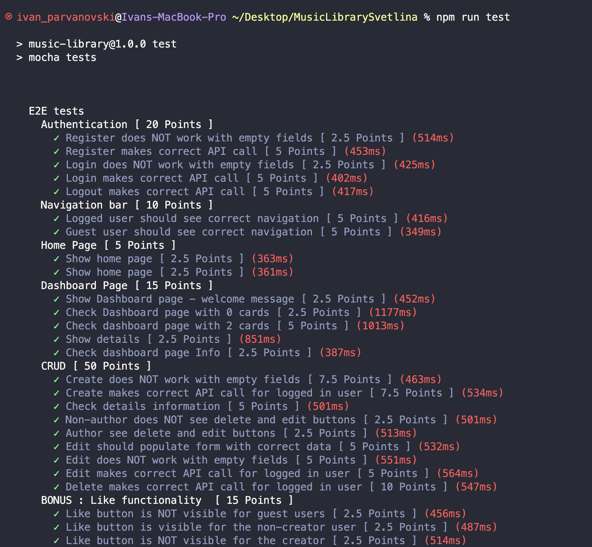
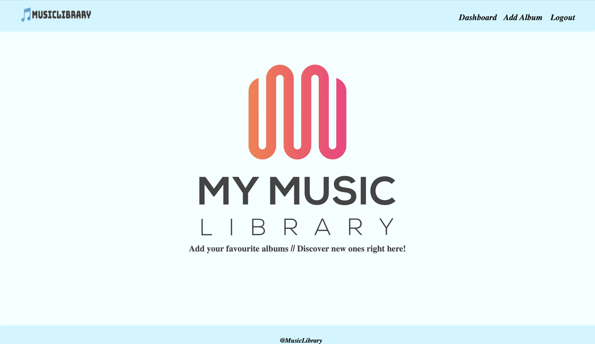
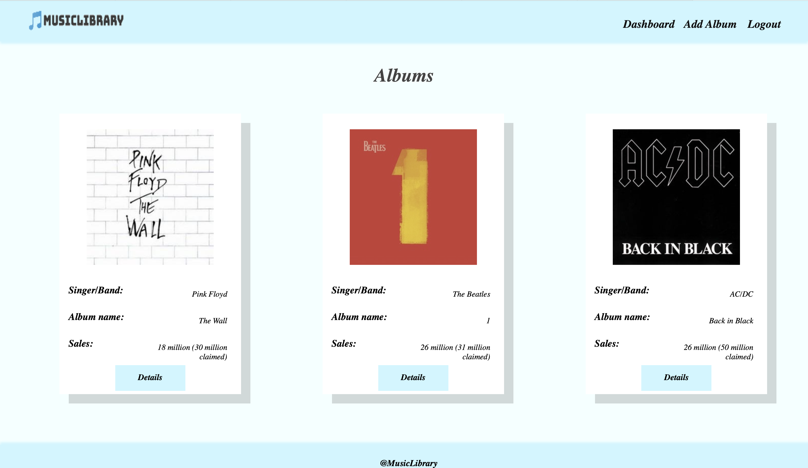
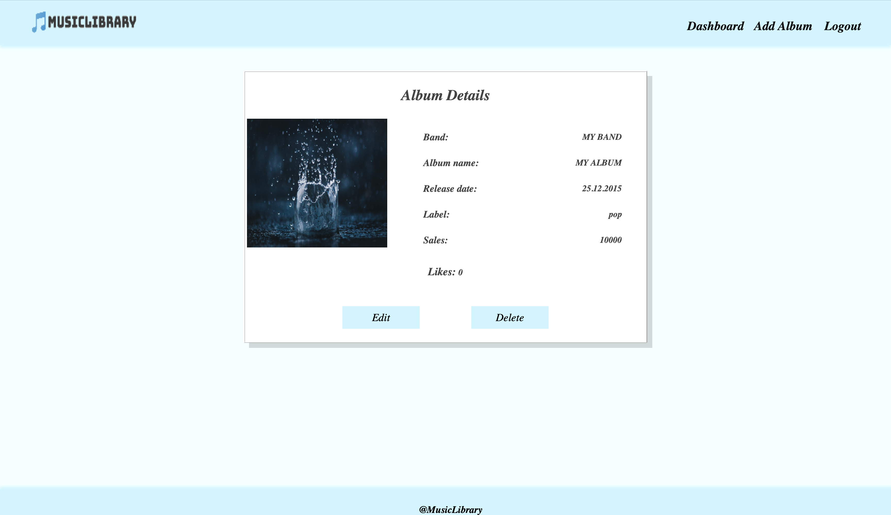
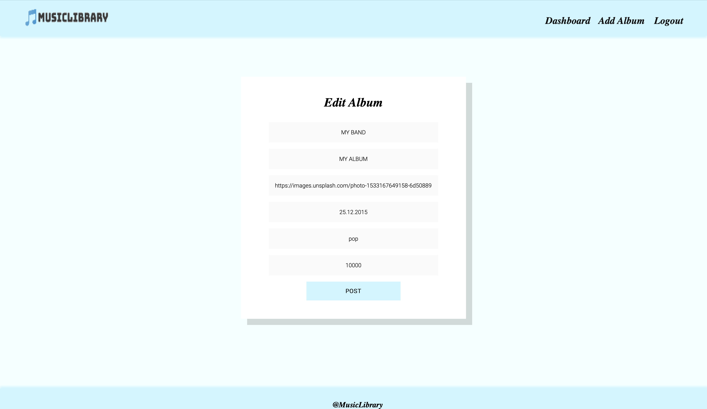
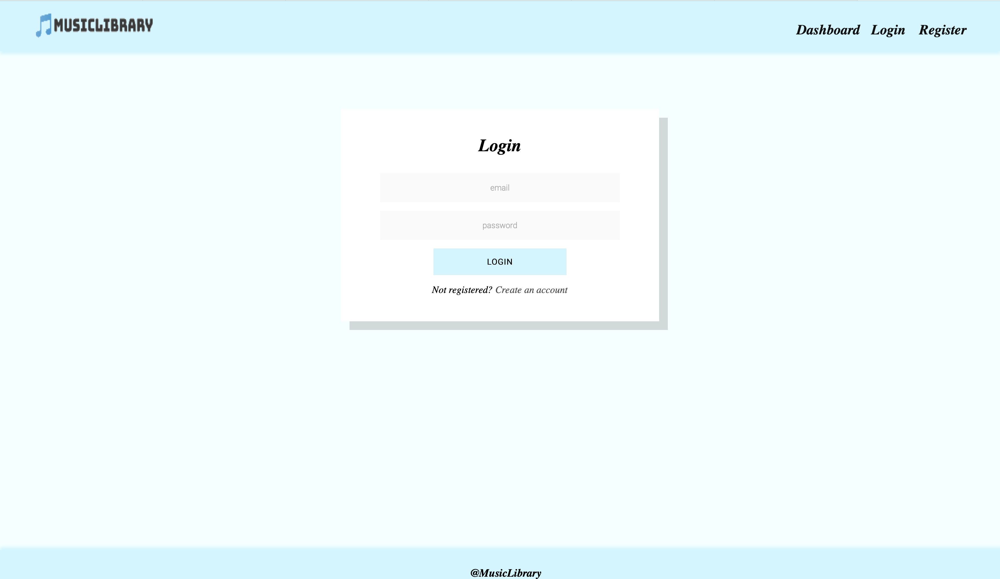
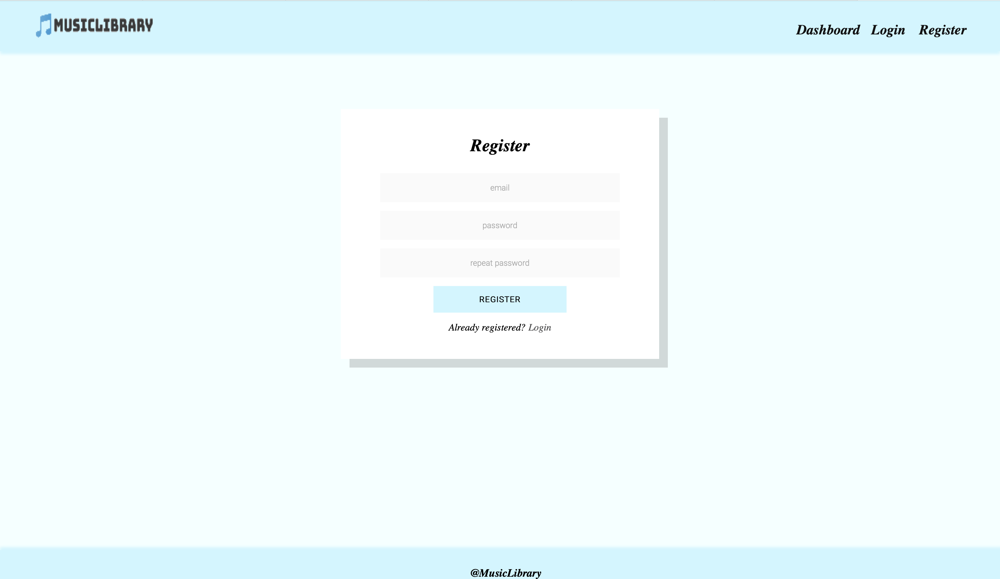
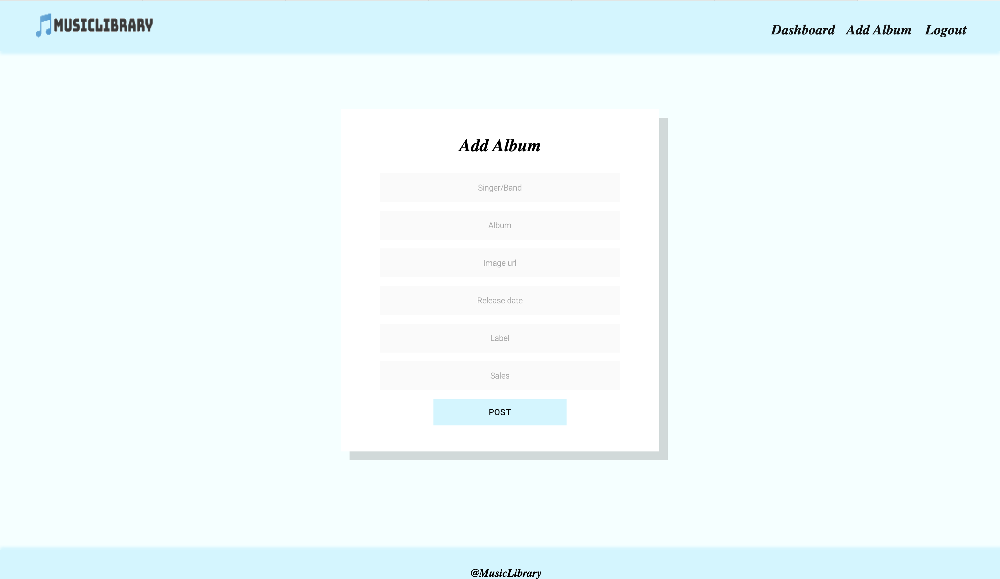

# MusicLibrary


### Description

MusicLibrary is a comprehensive music library management application designed to provide music enthusiasts with a seamless platform to organize, store, edit, and explore their favorite albums. With its intuitive interface and powerful features, MusicLibrary empowers users to curate their music collection with ease while ensuring robust security through authentication and authorization mechanisms.

---
### Installation and set up

To install all dependencies listed in the `package.json` file of your project. Run the following command:

```
npm install
```

To start the project, execute `npm start`. It should run the project on http://localhost:3000/

```
npm start
```

---

### Endpoints and REST Api

* GET /data/albums?sortBy=_createdOn%20desc
* GET /data/albums/:id
* POST /data/albums
	* body { singer: string, album: string, imageUrl: string, release: number, label: string, sales: string }
* PUT /data/albums/:id
* DELETE /data/albums/:id
* POST /users/login
	* body { email: string, password: string }
* POST /users/register
* GET /users/logout
* POST /data/likes
	* body { albumId: string }
* GET /data/likes?where=albumId%3d%22:albumId%22%20&distinct=_ownerId&count

---

### Run tests and check result

In order to successfully run the test suite, ensure that the application is running. You can start the application by executing the command `npm start`. Once the application is up and running, you can proceed to run the tests using the following command: `npm run test`




---


### Pages and Permission 

| Page      | All Users | Authenticated Users |
| --------- | --------- | ------------------- |
| Home      | Yes       | Yes                 |
| Dashboard | Yes       | Yes                 |
| Login     | Yes       | No                  |
| Register  | Yes       | No                  |
| Create    | No        | Yes                 |
| Details   | Yes       | Yes                 |
| Edit      | No        | Yes                 |

* ##### Home



* ##### Dashboard



* ##### Details



* ##### Edit



* ##### Login



* ##### Register



* ##### Add


